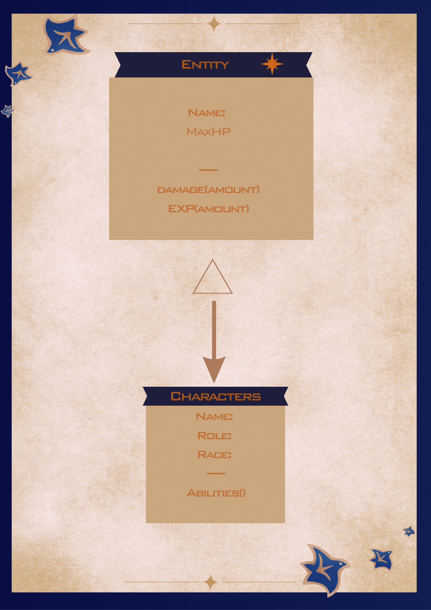
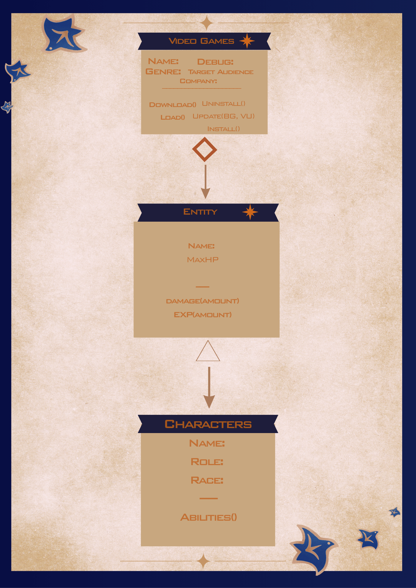
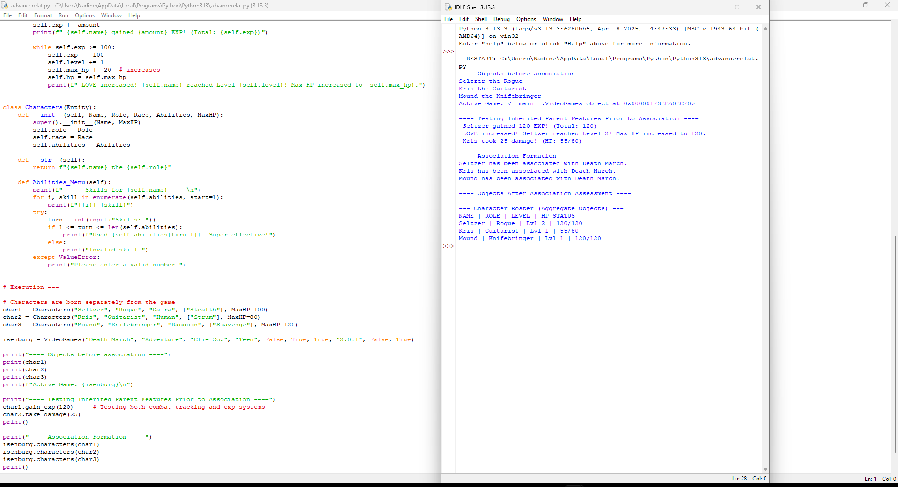
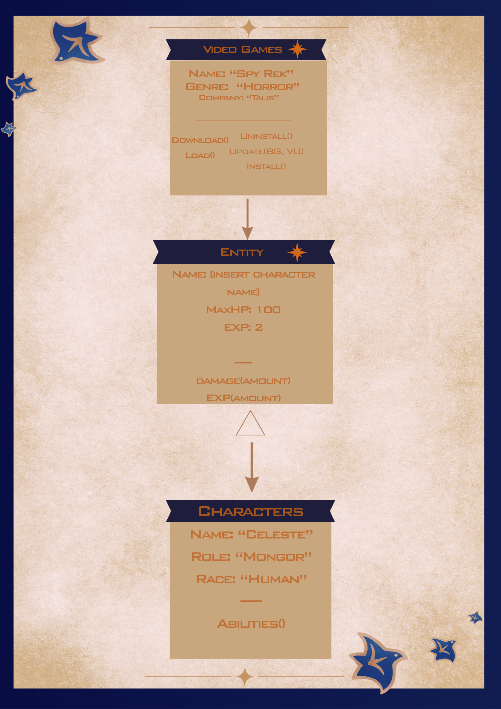

# Advanced Class Relationships
## Previous Activities
[classAttrib](classAttributesMethods.md)
[classRel](classRelationships.md)
## Existing System Description: 
As of prior to creating this activity, the system has the "main" class, Video Games, where many Characters are stored. The Video Game class contains general information regarding the game's genre, target audience and creators, as well as what operations initiate it. In the Character class, general information of the character's identity is stored too. Attributes such as the character's name, role and species, and abilities.
## Inheritance Relationship
Parent: Entity
Child: Characters
Explanation: Entities in the game concern status of the character. This includes the character's HP, EXP, and how much damage they respectively receive.
## Inheritance UML

## Composition/Aggregation
Relationship: Composition
Explanation: The characters must be created within the parent class. This makes it so that when the parent class is deleted, the characters will follow the same way. This makes the character class dependent on the existence of the parent class that way the data stored stays in the Video Game object.
## Advanced UML Diagram

## Python Implementation
[Source Code](advancedRelationships.py)
## Test Run

## Object Diagram

## Reflection
Answers:
