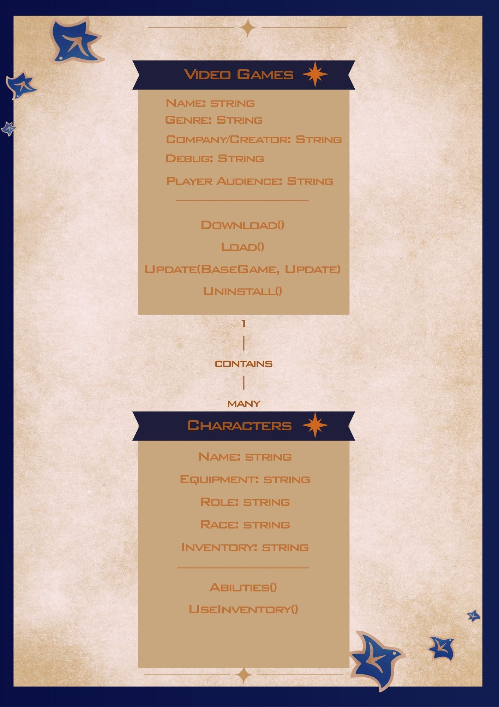
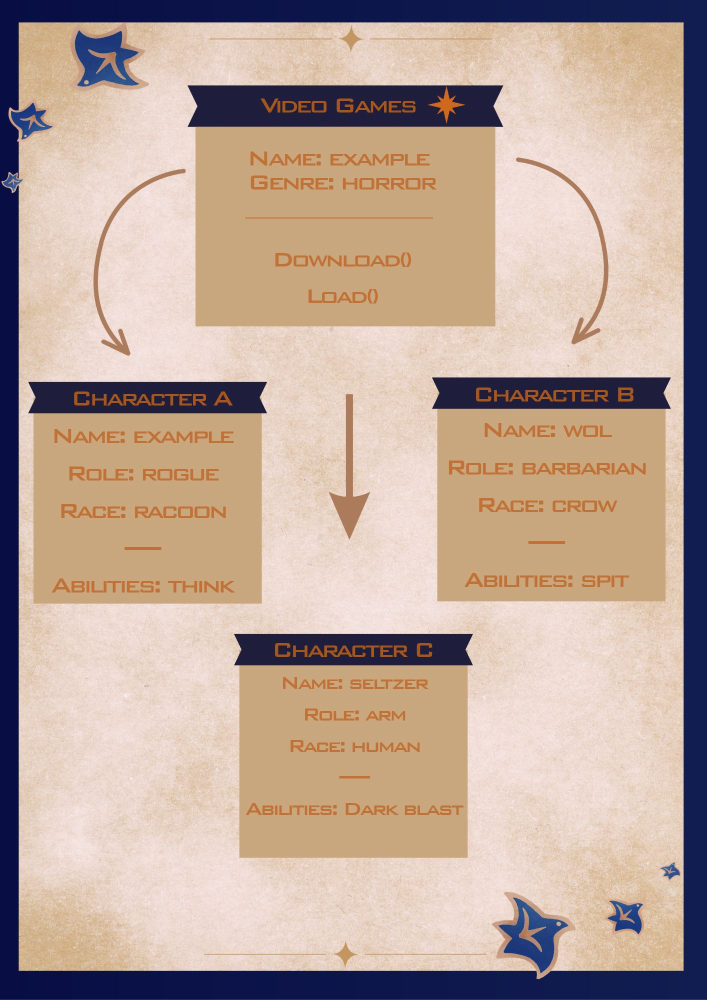

# Class Relationships: Association and Multiplicity

## Previous Work
[Part I - Classes and Objects](classObjectUML.md)
[Part II - Class Attributes and Methods](classAttributesMethods.md)

## Existing Class
Class: Video Games
Description: A game that utilizes a screen or electronics. This class focuses on the general aspects of a game. Which is its name, targeted audience, and creators. In addition, what is expected from a video game program; the booting up and deletion of the game.

## New Related Class
Class: Characters
Description: Characters comprise most video games as they generally have a protagonist a user plays as. They often do special abilities that stand out from NPCs.

## Association
Relationship: contain
Explanation: There can be more than one character in a video game. A character does not exist without a basis from where they came from. In short, a character cannot exist without a game.

## Multiplicity
Multiplicity: One-to-Many
Explanation: In a video game, there can be more than just a player or protagonist. There can be many characters a user can play as that would befit their playstyle.

## UML Class Relationship Diagram

## Python Implementation
[View Python Source](classRelationships.py)
## Test Run

## Object Relationship Diagram

## Analysis
### What is the association between your two classes?
- The video game contains a character. This is because more often than not, we experience video games through a main character we play as.
### What multiplicity did you choose and why?
- I picked a 'one-to-many'. A video game can have hundreds of characters if it wished. In story-telling video games, this creates a richer atmosphere; where characters can interact and build each other's identities. A video game with only one character would feel lonely--if it were the goal.
### How did you implement the relationship in Python?
### Why did you store an object reference instead of copying its data?
### If your relationship uses many, why is a list appropriate?
